# Kutu — Android TV Lite Launcher

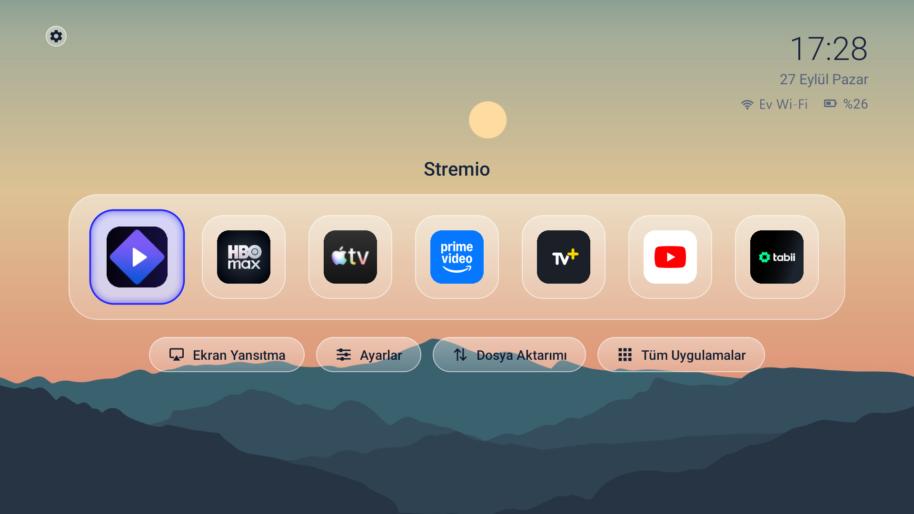

Kutu turns an older Android TV box into a fast, quiet appliance. It reversibly debloats the box, adds AirPlay screen mirroring, replaces the stock launcher with a lightweight liquid-glass home screen and adds browser-based file transfer.

There are two ways to get it:

- **One command** puts the latest release on a box. You only type the TV's IP address.
- **Claude Code and the master guide** build and sign everything for a new device from source (see [Build it yourself with Claude Code](#build-it-yourself-with-claude-code)).

Developed and tested on:

- Xiaomi Mi Box 3 (original guide)
- Xiaomi Mi Box S 1st gen (MIBOX4) with Android TV 9 (API 28, 32-bit ARM), this repository's reference box

## One-command install

**On the TV**
1. Go to Settings → Device Preferences → About and press **Build** 7 times.
2. Go to Settings → Device Preferences → Developer options and turn **USB debugging** on. If the box also has **Network debugging**, turn it on too.
3. Note the TV's IP address: Settings → Network & Internet → your network.

**On a Windows PC on the same network**, open PowerShell and paste:

```powershell
irm https://github.com/coraspirin/android-tv-lite-launcher/releases/latest/download/install.ps1 | iex
```

Type the IP when asked. When the TV asks, choose **Always allow from this computer** and press OK. Then wait until it says it is done. The installer:

- downloads ADB from Google if the PC doesn't have it
- downloads the three apps from the latest release and **checks every file's SHA-256** before installing anything
- grants the permissions the apps need, so no dialogs pop up on the TV
- on a Mi Box S, disables ads, telemetry and unused system packages; it only uses `pm disable-user`, so every change can be undone
- makes Kutu Home the home screen, restarts the box and checks the result
- saves a list of every change and how to undo it to `Documents\Kutu\` on the PC
- turns ADB off on the TV at the end, for safety

You can run it again at any time. Anything already up to date is skipped.

After that the PC is no longer needed. Updates come from the TV itself: **Kutu Home → ⚙ (top left) → Güncellemeleri denetle**.

<details>
<summary>Türkçe kısa kurulum</summary>

1. TV'de: Ayarlar → Cihaz Tercihleri → Hakkında → **Yapı** satırına 7 kez basın.
2. Ayarlar → Cihaz Tercihleri → Geliştirici seçenekleri → **USB hata ayıklama** AÇIK.
3. TV ile aynı ağdaki Windows bilgisayarda PowerShell'i açın, yukarıdaki komutu yapıştırın ve TV'nin IP adresini yazın.
4. TV'de "Bu bilgisayardan her zaman izin ver" kutusunu işaretleyip Tamam'a basın. "Bitti" yazana kadar bekleyin.

Sonraki güncellemeler için bilgisayar gerekmez: Kutu Home → sol üstteki çark → Güncellemeleri denetle.
</details>

## What you get

| App | Package | What it does |
|---|---|---|
| **Kutu Home** | `local.kutu.home` | Liquid-glass launcher with a centred shelf, focus rings coloured by each app's icon, a light, dark or automatic theme, the Wi-Fi name and the remote's battery under the clock, and a background chosen from your own photos. It has no network permission, no background service and 0 % idle CPU |
| **Kutu Mirror** | `local.kutu.mirror` | AirPlay receiver named **Kutu**. It mirrors an iPhone, iPad or Mac screen with sound, follows the phone when it rotates, and plays AirPlay Video. It uses hardware H.264 only and holds no wakelock while idle. It never opens its screen from a bare network connection |
| **Kutu Aktarım** | `local.kutu.transfer` | On-demand, PIN-protected file transfer from any browser on your network. You can upload, download and install APKs. Close the screen and the port closes with it. It also delivers background photos to Kutu Home and installs updates from GitHub Releases |

## Screens

| | |
|---|---|
|  | 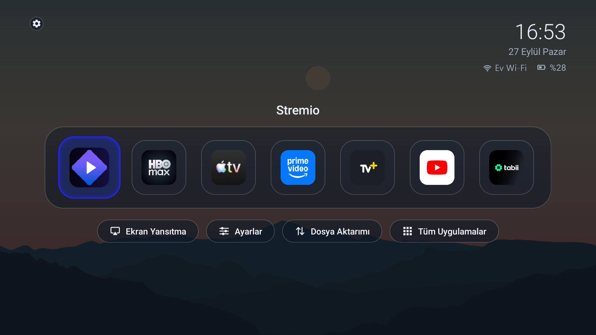 |
| Home: shelf, chips, clock with Wi-Fi name and remote battery | Dark theme, by hand or automatically in the evening |
| 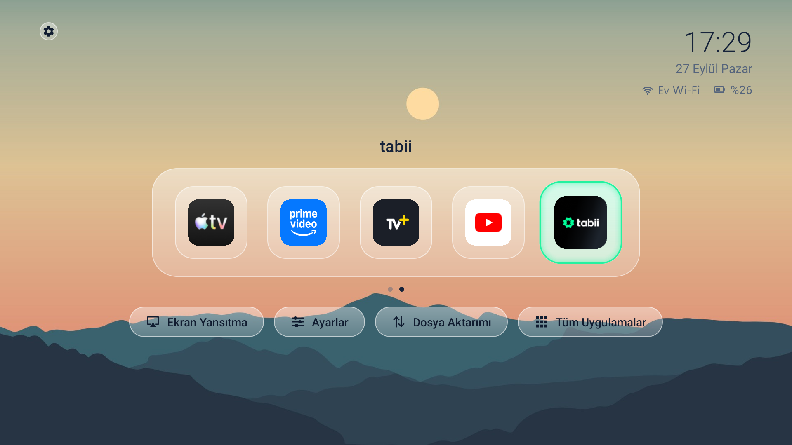 | 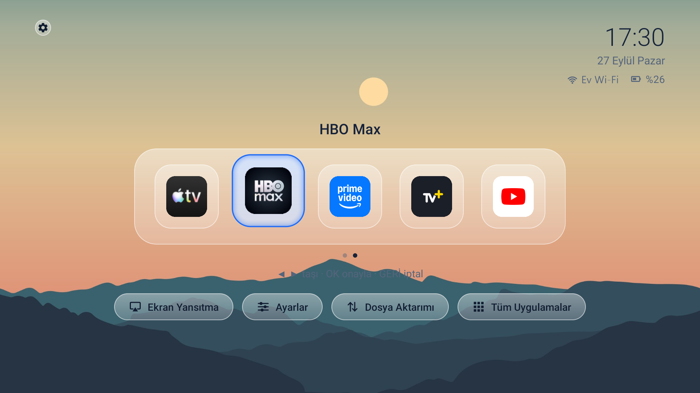 |
| More apps than the shelf shows: it scrolls by whole tiles, with page dots | Long press → Taşı: ◀ ▶ moves, OK saves, BACK cancels |
| 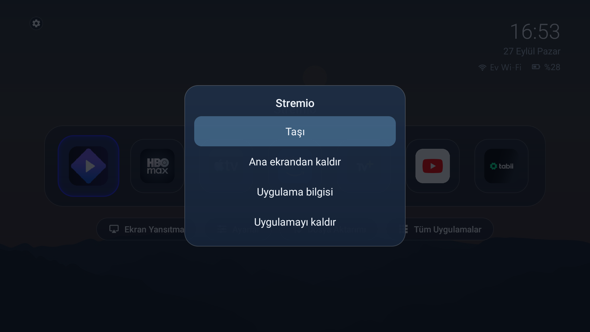 | 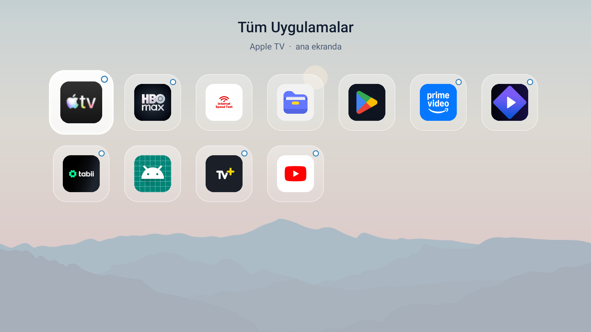 |
| Long-press menu on a home tile | All apps; a dot marks the ones already on the shelf |
| 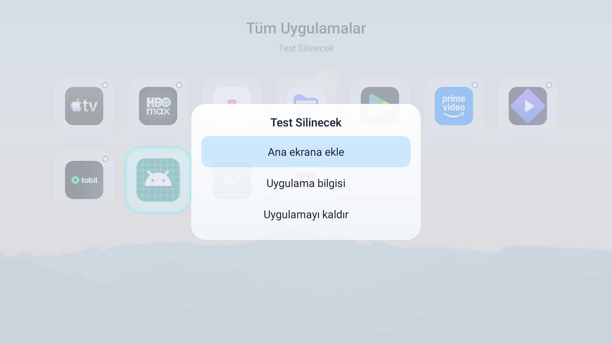 | 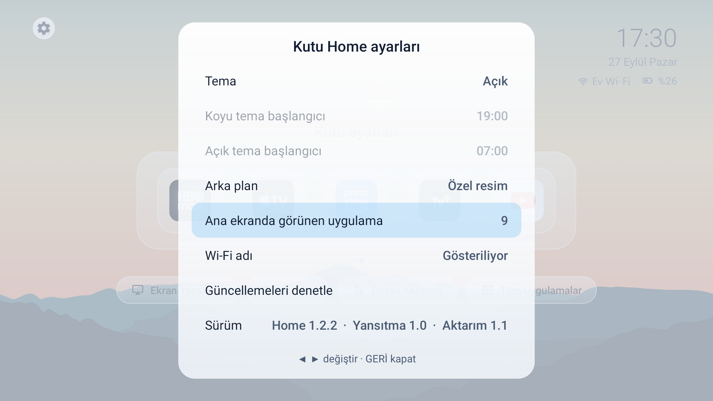 |
| Adding an app to the home screen | ⚙ settings: theme, background, how many apps the shelf shows, updates |
| 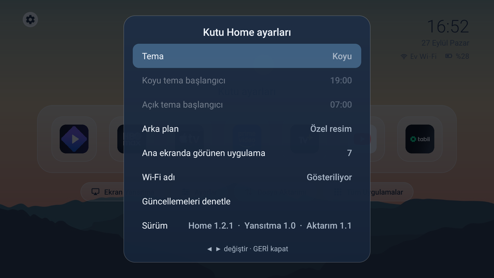 | 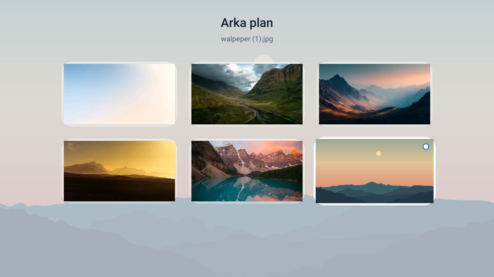 |
| Settings in the dark theme | Background picker: photos sent from a phone through Kutu Aktarım |
| 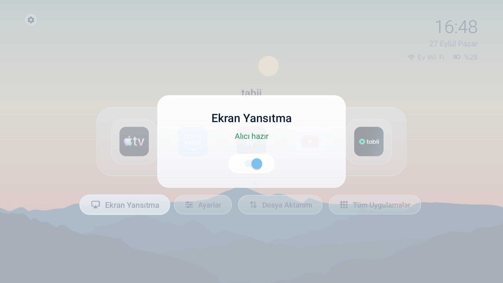 | 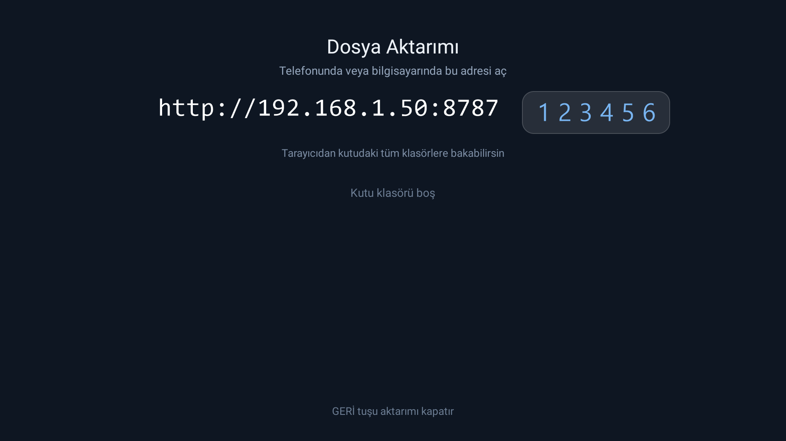 |
| Screen mirroring on/off | File transfer session: address and one-time PIN (example values) |
| 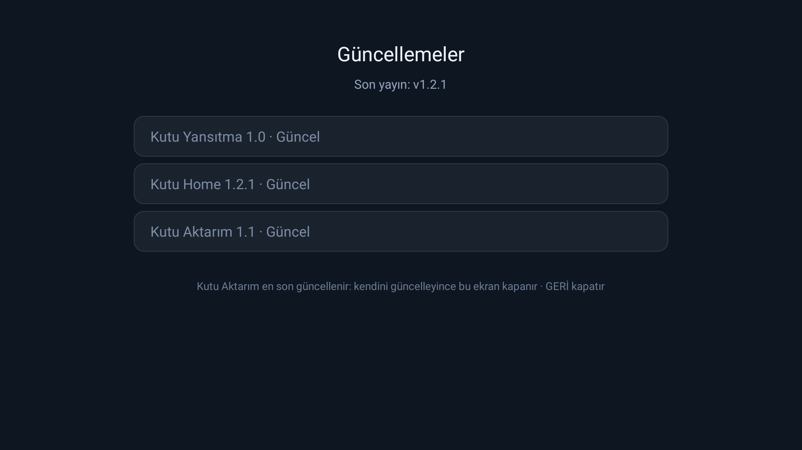 | |
| Updates straight from GitHub Releases, with SHA-256 and signature checks | |

## Build it yourself with Claude Code

The whole build workflow lives in **one file**, [`MIBOX-CLAUDE-MASTER-GUIDE.md`](MIBOX-CLAUDE-MASTER-GUIDE.md). You give it to Claude Code. Claude inspects your device, adapts the steps to it and carries them out, checking with you at each safety checkpoint.

1. Enable Developer Options and USB/network debugging on the TV box.
2. Install ADB and check that `adb devices` lists the box as `device`.
3. Give Claude Code `MIBOX-CLAUDE-MASTER-GUIDE.md`. If you want your own wallpaper, give it a 16:9 image too.
4. Follow Claude's checkpoints: your app usage, the initial dock, real-remote tests, the iPhone AirPlay test and HOME approval.
5. At the very end, turn debugging off.

If you **clone the whole repository**, Claude starts from the tested source under `build/` and adapts it to your device instead of writing the apps from scratch. On this path everything is rebuilt and signed locally with your own keys. `tools/release.ps1` then publishes your own releases, which the one-command installer and the in-app updater use.

## Repository layout

| Path | Content |
|---|---|
| `install.ps1` | the one-command installer (also attached to every release) |
| `tools/release.ps1` | packages the signed APKs, `kutu-versions.json` and `install.ps1` as a GitHub Release |
| `MIBOX-CLAUDE-MASTER-GUIDE.md` | the build workflow for Claude Code |
| `build/kutu-home/` | Kutu Home source (plain Java, zero dependencies) |
| `build/kutu-mirror/` | Kutu Mirror source, a GPL-3.0 fork of [jqssun/android-airplay-server](https://github.com/jqssun/android-airplay-server) |
| `build/kutu-transfer/` | Kutu Aktarım source (plain Java, zero dependencies) and its page tests |
| `build/assets/kutu-home-background.png` | default wallpaper |
| `RESTORE-ALL.ps1`, `PROJECT-PACKAGES.txt`, `PRESERVED-PRIOR-DISABLES.txt` | rollback for the reference box |
| `KUTU-HOME.md`, `KUTU-MIRROR.md`, `KUTU-TRANSFER.md` | build and test records of the reference box |
| `docs/screenshots/` | the screens above, taken on the reference box |

## Reference results (Mi Box S)

| | Before | After |
|---|---|---|
| Launcher memory | ~64 MB, plus a recommendations process | ~23 MB, no services |
| Launcher-related processes | ~120 MB | ~20–25 MB |
| AirPlay receiver | none | ~10 MB idle, 0 % CPU |
| `/data` free | 1.9 GB | 2.6–2.8 GB |

Results depend on the device. Don't expect identical numbers on other hardware.

## Important

- The installer's debloat list was checked on a Mi Box S only. On any other box it skips that step and only installs the apps and sets the home screen.
- Every system-package change is reversible. To undo them, turn USB debugging back on (Kutu Home → Ayarlar → Device Preferences → Developer options) and follow the file the installer saved in `Documents\Kutu\`, or run `RESTORE-ALL.ps1`.
- If you build your own releases, back up the `keys/` folder somewhere outside the repository. Without it the Kutu apps can never be updated in place.
- Building Kutu Mirror on Windows requires WSL2 (Ubuntu). Kutu Home and Kutu Aktarım build on Windows directly.

## Credits

- Original guide and background: [bevcko16/kutu-android-tv-guide](https://github.com/bevcko16/kutu-android-tv-guide)
- AirPlay receiver upstream: [jqssun/android-airplay-server](https://github.com/jqssun/android-airplay-server) (GPL-3.0)

## Disclaimer

This is an enthusiast project. Android TV firmware differs by manufacturer and model. Keep rollback access available and do not disable packages whose purpose is unclear.
